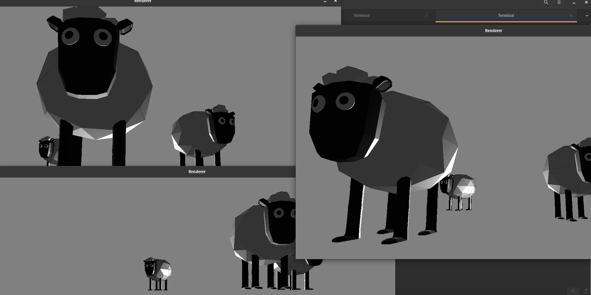

# OpenGL Based 3D Renderer With MMO feature

## Overview

A 3D renderer using OpenGL that supports massively multiplayer online (MMO) network system. This project includes an OpenGL-based graphics engine, object loading with Assimp, lighting and shading with shaders, and a server-client architecture for MMO functionality.


## Features

- Explore the world with the moving camera:- W, S, A, D, E, Q keys and mouse.
- Move the player around:- O, K, J, L keys.
- Start the MMO feature: V key.
- Ping the MMO server:- P key.

- Use the W, S, A, D, E, Q key to move the around in forward, backward and upward direction. Use mouse to see all around.
- Use O, K, J, L keys to move the player around.
- Press the V key to toggle the start and stop of MMO feature.
- Press the P key to ping the MMO server.
- Press the T key to toggle disabling the cursor.
- Press Esc key to close the window.
- Press R key to put your player to its initial position in the world.

## Getting Started

### Prerequisites
Ensure you have the following installed:

- Assimp
- Boost 1.84

### Installation

1. Clone the repository:
    ```sh
    git clone --recursive https://github.com/nirmal499/3d-renderer.git
    cd 3d-renderer
    ```

2. Configure and build the project:
    ```sh
    chmod u+x run.sh

    # Configure the project
    ./run.sh project-configure-fresh

    # Build the project
    ./run.sh project-build
    ```

### Usage

#### Running the Renderer(client)
```sh
./run.sh project-run-client
```

#### Running the MMO server
```sh
./run.sh project-run-server
```
**A lot more features will be added in this project {WORK IN PROGRESS}**